# Rentivo — Руководство пользователя / User Guide

---

## 🇷🇺 Русский

### Что такое Rentivo?

Rentivo — приложение для личных финансов на iPhone. Помогает следить за банковскими вкладами, контролировать подписки и видеть, сколько вы зарабатываете и тратите каждый месяц.

Все данные хранятся **только на вашем устройстве** — без регистрации, без облака, без доступа к вашим счетам.

---

### Первый запуск

При первом открытии приложение предложит два варианта:

- **Попробовать с примером данных** — приложение заполнится демонстрационными вкладами и подписками, чтобы вы сразу увидели как всё работает
- **Начать с чистого листа** — сразу приступить к добавлению своих данных

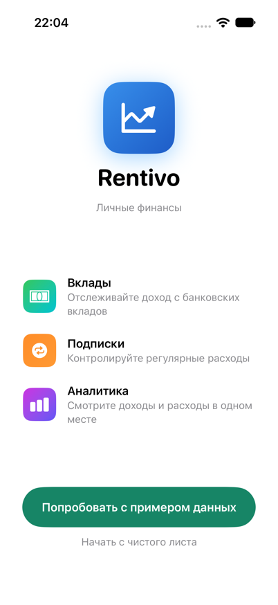

---

### Главный экран

Открывается сразу после первого запуска. Показывает две карточки:
- **Ближайшие платежи** — до 5 подписок с самой близкой датой следующего платежа
- **Открытые вклады** — вклады, которые ещё не закрыты, отсортированные по дате закрытия

Потяните экран вниз, чтобы обновить данные. Шестерёнка в правом верхнем углу открывает Настройки.

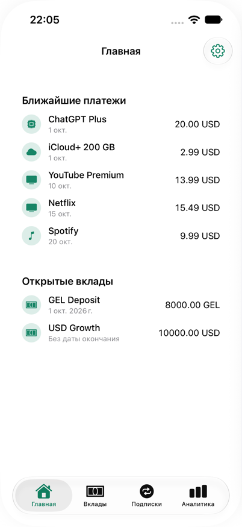

---

### Вклады

Раздел для отслеживания банковских вкладов с автоматическим расчётом дохода — включая капитализацию, пополнения/снятия и досрочное закрытие.

**Что показывает карточка вклада:**
- Название и банк
- Статус — **Активен** / **Закрыт**
- Сумма и валюта
- Ставка (% годовых)
- Значок ⟲ и подпись «Капитализация» — если у вклада капитализация процентов
- Значок замка и подпись «Безотзывный» — если вклад безотзывный
- Даты открытия и закрытия, прогресс-бар до даты закрытия
- **Доход на сегодня** (для активных) / **Заработано** (для закрытых)
- **Прогноз до закрытия** — сколько всего заработаете к концу срока (только для активных)

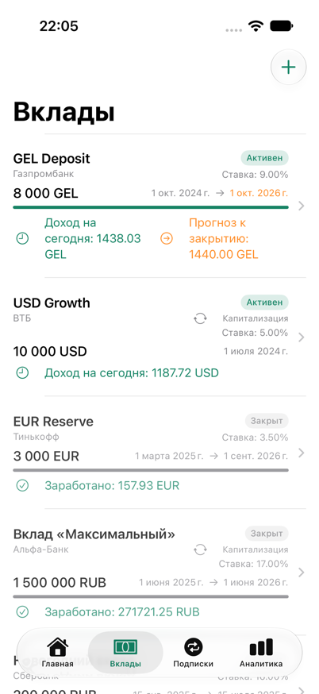

**Как добавить вклад:**
1. Нажмите **+** в правом верхнем углу
2. Введите название, банк (необязательно), сумму и валюту
3. Укажите дату открытия
4. Включите переключатель «Указать дату закрытия» и выберите дату, если вклад срочный
5. Введите годовую ставку в процентах
6. При желании настройте дополнительные параметры (см. ниже)
7. Нажмите **Сохранить**

**Редактирование:** откройте вклад (тап по карточке) → нажмите **«Изменить»** на экране деталей. Тап по карточке в самом списке сразу в форму редактирования не ведёт — сначала открывается экран деталей (см. ниже).
**Удаление:** смахните карточку влево в списке → подтвердите удаление.

> Приложение напомнит вам за **7 дней до закрытия** вклада (нужно разрешить уведомления).

#### Начисление процентов: простой процент или капитализация

При добавлении/редактировании вклада можно выбрать:
- **Простой** — проценты начисляются только на исходную сумму
- **Капитализация** — проценты периодически прибавляются к сумме вклада, и дальше начисляются уже на увеличенную сумму. При выборе капитализации нужно указать период: **ежемесячно / ежеквартально / ежегодно**

#### Пополнение и частичное снятие

Если у вклада указана дата закрытия, в форме появляются два переключателя:
- **Разрешить пополнение** — можно будет добавлять деньги на вклад позже
- **Разрешить частичное снятие** — можно будет снимать часть суммы досрочно

Если хотя бы один из них включён, на экране деталей вклада (см. ниже) появятся кнопки **«+ Пополнить»** и/или **«− Снять»**.

#### Отзывность и досрочное закрытие

Переключатель **«Безотзывный»** — если включить, появляется поле **«Ставка при досрочном закрытии, %»** (не может быть выше основной ставки). По безотзывному вкладу, закрытому раньше плановой даты, доход пересчитывается по этой (обычно более низкой) ставке — как в реальном банке.

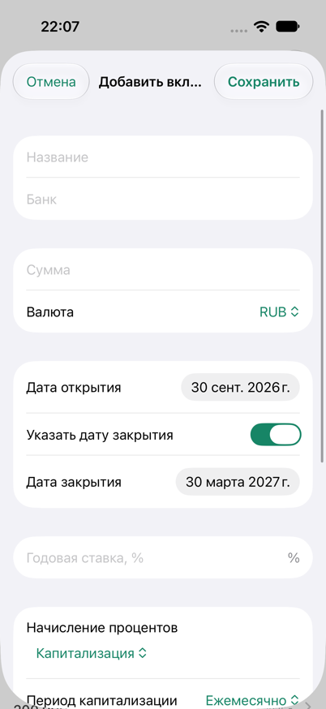
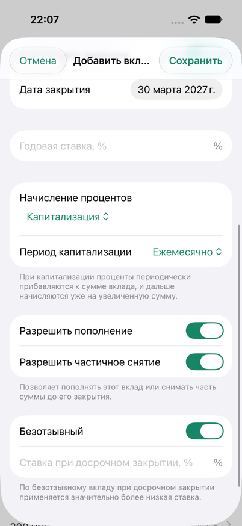

#### Экран деталей вклада

Открывается по тапу на вклад в списке. Показывает крупную текущую сумму, те же значки, что и в карточке списка, и три секции:

- **Кнопка «Закрыть вклад»** (красная, под значками) — видна только у ещё открытых вкладов. Закрывает вклад сегодняшним днём. Если вклад безотзывный и плановая дата закрытия ещё не наступила, перед подтверждением покажет точную сумму процентов, которую вы потеряете при досрочном закрытии
- **«Рост вклада»** — график баланса во времени: сплошная линия — фактический рост, пунктирная — прогноз до плановой даты закрытия (только для ещё открытых вкладов)
- **«История операций»** — список пополнений/снятий с остатком после каждой операции; кнопки **«+ Пополнить»** / **«− Снять»**, если разрешено (см. выше). При снятии нельзя указать сумму больше текущего остатка вклада

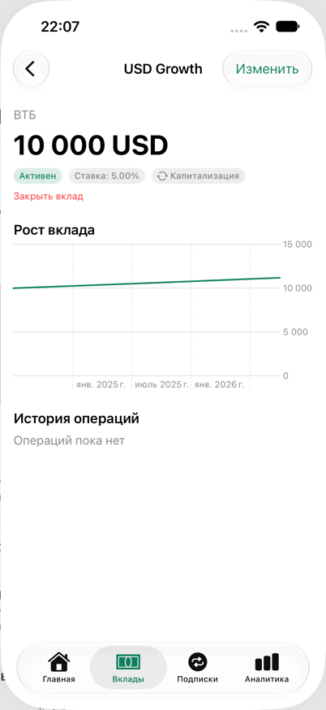

---

### Подписки

Раздел для учёта всех регулярных и разовых платежей: стриминговые сервисы, приложения, членства.

**Виды подписок:**
| Периодичность | Описание |
|--------------|---------|
| Еженедельная | Каждые 7 дней |
| Ежемесячная | Раз в месяц |
| Ежеквартальная | Раз в 3 месяца |
| Годовая | Раз в год |
| Единоразовая | Одна оплата, без повторений |

**Что показывает карточка подписки:**
- Название и категория
- Сумма и периодичность
- Дата следующего платежа (для регулярных) или дата покупки (для разовых)
- Примерная стоимость в месяц (для периодов не ежемесячных)
- Статус: **Активна** / **Отменена** / **Оплачено** (для уже совершённых разовых покупок)

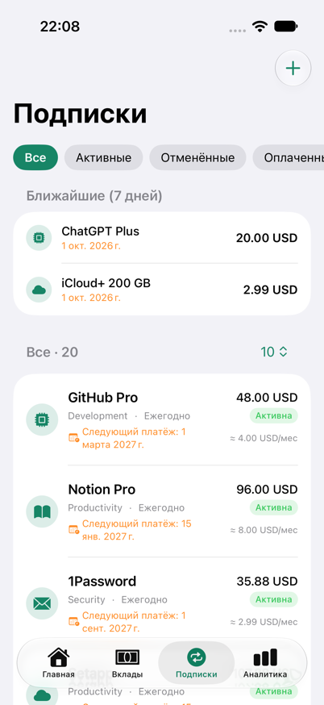

**Фильтры** (лента вверху списка):
- **Все** — полный список
- **Активные** — текущие подписки
- **Отменённые** — подписки, которые вы отменили
- **Оплаченные** — уже совершённые разовые покупки

**Ближайшие платежи (7 дней)** — отдельная секция сверху списка с подписками, платёж по которым ожидается в ближайшую неделю.

Ниже — сама лента подписок с постраничным показом (5 / 10 / все — через меню в заголовке секции).

**Как добавить подписку:**
1. Нажмите **+**
2. Выберите иконку из готового набора
3. Введите название, категорию (необязательно), сумму, валюту
4. Выберите периодичность
5. Укажите дату первого платежа (или дату покупки для разовой)
6. Нажмите **Сохранить**

**Редактирование:** нажмите на подписку в списке.
**Отмена подписки:** откройте редактирование → выключите переключатель «Активна» → появится поле даты окончания → подписка переместится в «Отменённые» и будет исключена из аналитики.
**Удаление:** смахните карточку влево.

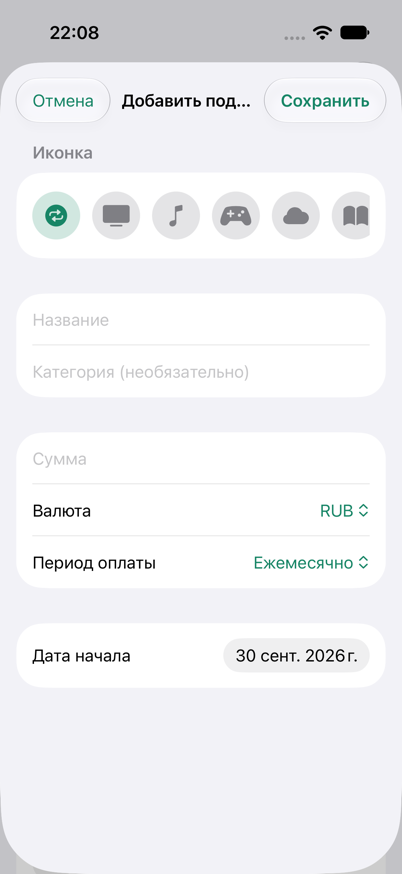

> Приложение напомнит вам **в день списания**, в 9:00 (нужно разрешить уведомления).

---

### Аналитика

Сравнение доходов от вкладов и расходов на подписки по месяцам.

**Как читать экран аналитики:**

1. **Выбор года** — стрелками листайте между годами
2. **Выбор валюты** — если у вас несколько валют, переключайтесь между ними
3. **Фактически** — реальные суммы с 1 января по сегодня:
   - Доход — проценты по вкладам, накопленные за этот период
   - Расходы — платежи по подпискам за этот период
   - Итого — разница (зелёный = вы в плюсе, красный = подписки дороже вкладов)
4. **За месяц** — то же самое, но за один выбранный месяц (переключение месяца стрелками)
5. **За год** — итог за весь год, включая прогноз на оставшиеся месяцы, если год текущий или будущий
6. **График** — столбцы по месяцам; бирюзовый — доход, оранжевый — расходы

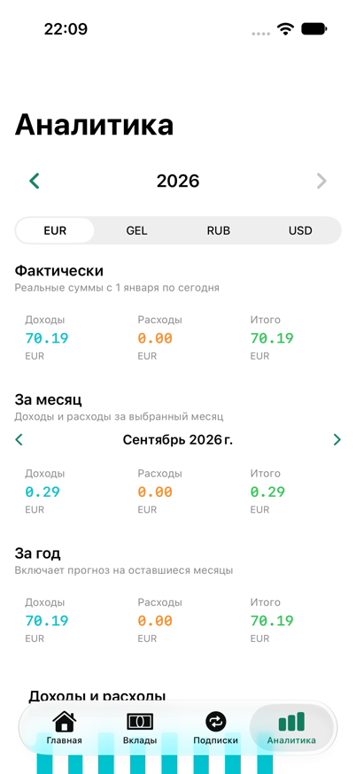

---

### Настройки

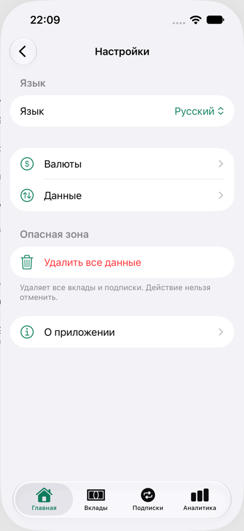

#### Язык
Переключение между **Русским** и **English**. Вступает в силу мгновенно, независимо от языка системы.

#### Валюты
Выберите, какие валюты отображаются в формах добавления и в аналитике. Минимум одна валюта должна быть включена.

Доступные валюты: **USD, EUR, RUB, GEL, BYN**

#### Данные (экспорт/импорт)

Три независимых CSV-файла:
- **Вклады** — включая тип начисления, капитализацию, пополнение/снятие, отзывность
- **Подписки**
- **История операций** — пополнения и снятия по вкладам

Экспорт сохраняет файл и открывает системное меню «Поделиться» (AirDrop, Файлы, почта и т.д.). Импорт открывает системный выбор файла; дубликаты (записи с уже существующим ID) автоматически пропускаются — после импорта показывается сводка: сколько добавлено, сколько пропущено, сколько не удалось разобрать.

CSV-файлы вкладов, экспортированные более старой версией приложения (без полей типа начисления/капитализации/отзывности), всё равно успешно импортируются — недостающие поля получат значения по умолчанию (простой процент, без капитализации, отзывный).

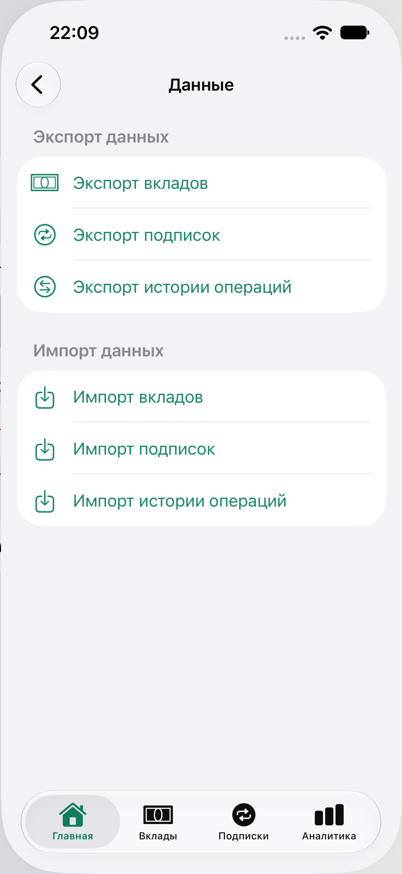

#### Опасная зона / Сбросить все данные
Удаляет все вклады, подписки и историю операций и возвращает приложение к экрану первого запуска. **Это действие нельзя отменить.**

---

### Виджеты на главном экране

Приложение добавляет на главный экран iOS два виджета: **Вклады** (один открытый вклад) и **Подписки** (ближайший предстоящий платёж). Виджеты только показывают данные — изменить что-либо через них нельзя.

---

### Часто задаваемые вопросы

**Приложение подключается к моему банку?**
Нет. Rentivo не имеет доступа к вашим счетам. Все данные вы вводите вручную.

**Где хранятся мои данные?**
Только на вашем устройстве. Данные не отправляются никуда.

**Чем капитализация отличается от простого процента?**
При простом проценте доход считается только от исходной суммы вклада за весь срок. При капитализации проценты периодически (ежемесячно/ежеквартально/ежегодно) прибавляются к сумме вклада, и дальше сами начинают приносить доход — итоговая сумма получается больше при одинаковой ставке.

**Что будет, если закрыть безотзывный вклад досрочно?**
Приложение честно предупредит, сколько процентов вы потеряете, и пересчитает доход по ставке «до востребования» (которую вы указали при создании вклада), а не по основной ставке.

**Как создать резервную копию?**
Используйте Настройки → Данные → Экспорт. Сохраните все три CSV-файла (вклады, подписки, история операций) в надёжное место.

**Как перенести данные на новый iPhone?**
Экспортируйте все три файла на старом устройстве → установите Rentivo на новом → импортируйте их по очереди (вклады перед историей операций, так как операции ссылаются на ID вкладов).

**Поддерживается ли iPad?**
Да, приложение работает на iPad.

---

---

## 🇬🇧 English

### What is Rentivo?

Rentivo is a personal finance app for iPhone. It helps you track bank deposits, manage subscriptions, and see how much you earn and spend each month.

All your data is stored **only on your device** — no registration, no cloud, no access to your bank accounts.

---

### First Launch

When you open the app for the first time, you'll be offered two options:

- **Try with sample data** — the app will be pre-filled with demo deposits and subscriptions so you can see how everything works right away
- **Start fresh** — go straight to adding your own data

---

### Home Screen

Shown right after first launch. Two cards:
- **Upcoming Payments** — up to 5 subscriptions with the nearest next-payment date
- **Open Deposits** — deposits that haven't closed yet, sorted by close date

Pull down to refresh. The gear icon in the top-right corner opens Settings.

---

### Deposits

Track your bank deposits with automatic interest income calculation — including compounding, contributions/withdrawals, and early closure.

**What a deposit card shows:**
- Name and bank
- Status — **Active** / **Closed**
- Amount and currency
- Interest rate (% per year)
- A ⟲ icon and "Capitalized" label — if the deposit compounds interest
- A lock icon and "Non-revocable" label — if the deposit is non-revocable
- Open and close dates, a progress bar toward the close date
- **Income to date** (active) / **Earned** (closed)
- **Forecast to close** — projected total interest by the end of the term (active only)

**How to add a deposit:**
1. Tap **+** in the top right corner
2. Enter name, bank (optional), amount, and currency
3. Set the open date
4. Toggle "Specify close date" and pick a date if the deposit has a fixed term
5. Enter the annual interest rate as a percentage
6. Optionally configure the additional settings below
7. Tap **Save**

**Edit:** open a deposit (tap its card) → tap **"Edit"** on the detail screen. Tapping a card in the list itself opens the detail screen first, not the edit form directly (see below).
**Delete:** swipe left on the card in the list → confirm deletion.

> The app will remind you **7 days before** a deposit closes (notification permission required).

#### Interest: simple or capitalized

When adding/editing a deposit, choose:
- **Simple** — interest is calculated only on the original amount
- **Capitalized** — interest is periodically added to the deposit's balance, and further interest accrues on the larger amount. Pick a period: **monthly / quarterly / yearly**

#### Contributions and partial withdrawals

If the deposit has a close date, two toggles appear in the form:
- **Allow contributions** — lets you add money to the deposit later
- **Allow partial withdrawals** — lets you withdraw part of it early

If either is on, the deposit's detail screen (below) shows **"+ Add funds"** and/or **"− Withdraw"** buttons.

#### Revocability and early closure

The **"Non-revocable"** toggle reveals a **"Rate on early withdrawal, %"** field (can't exceed the deposit's main rate). Closing a non-revocable deposit before its planned close date recalculates the interest at this (usually lower) rate instead of the agreed one — just like a real bank.

#### Deposit detail screen

Opens by tapping a deposit in the list. Shows the current balance, the same badges as the list card, and three sections:

- **"Close Deposit" button** (red, under the badges) — shown only for still-open deposits. Closes the deposit as of today. If it's non-revocable and the planned close date hasn't arrived yet, you'll see the exact amount of interest you'd lose before confirming
- **"Growth"** — a balance-over-time chart: solid line for actual history, dashed for the forecast to the planned close date (open deposits only)
- **"Transaction History"** — contributions/withdrawals with the running balance after each; **"+ Add funds"** / **"− Withdraw"** buttons if enabled above. A withdrawal can't exceed the current balance

---

### Subscriptions

Track all your recurring and one-time payments: streaming services, apps, memberships.

**Billing cycles:**
| Cycle | Description |
|-------|-------------|
| Weekly | Every 7 days |
| Monthly | Once a month |
| Quarterly | Every 3 months |
| Yearly | Once a year |
| One-time | Single payment, no recurrence |

**What a subscription card shows:**
- Name and category
- Amount and billing cycle
- Next payment date (recurring) or purchase date (one-time)
- Approximate monthly cost (for non-monthly cycles)
- Status: **Active** / **Cancelled** / **Paid** (for one-time purchases already made)

**Filters** (top of the list):
- **All** — full list
- **Active** — current subscriptions
- **Cancelled** — subscriptions you've cancelled
- **Paid** — one-time purchases already made

**Upcoming (7 days)** — a separate section at the top for subscriptions due within the next week.

Below it, the full list with pagination (5 / 10 / all — via the menu in the section header).

**How to add a subscription:**
1. Tap **+**
2. Pick an icon from the preset set
3. Enter name, category (optional), amount, currency
4. Choose billing cycle
5. Set the first payment date (or purchase date for one-time)
6. Tap **Save**

**Edit:** tap a subscription in the list.
**Cancel a subscription:** open edit → turn off "Active" → an end-date field appears → the subscription moves to "Cancelled" and is excluded from analytics.
**Delete:** swipe left on the card.

> The app will remind you **on the day of payment**, at 9:00 AM (notification permission required).

---

### Analytics

Compare income from deposits with subscription expenses, month by month.

**How to read the Analytics screen:**

1. **Year selector** — use arrows to navigate between years
2. **Currency selector** — if you have multiple currencies, switch between them
3. **"To date"** — actual amounts from January 1 to today:
   - Income — deposit interest accrued during this period
   - Expenses — subscription payments during this period
   - Net — the difference (green = you're ahead, red = subscriptions cost more)
4. **"By Month"** — the same three numbers for a single selected month (switch months with the arrows)
5. **"Full year"** — projection for the entire year including future months
6. **Chart** — monthly bars; teal = income, orange = expenses

---

### Settings

#### Language
Switch between **Русский** and **English**. Takes effect immediately, independent of the system language.

#### Currencies
Choose which currencies appear in add forms and analytics. At least one currency must remain enabled.

Available currencies: **USD, EUR, RUB, GEL, BYN**

#### Data (export/import)

Three independent CSV files:
- **Deposits** — including interest type, capitalization, contributions/withdrawals, revocability
- **Subscriptions**
- **Transaction History** — deposit contributions and withdrawals

Export saves the file and opens the system share sheet (AirDrop, Files, email, etc). Import opens the system file picker; duplicates (entries with an already-existing ID) are skipped automatically — a summary is shown afterward: how many were imported, skipped, or failed to parse.

Deposit CSV files exported by an older version of the app (without the interest-type/capitalization/revocability columns) still import successfully — missing fields fall back to the same defaults as a brand-new deposit (simple interest, no capitalization, revocable).

#### Danger Zone / Reset All Data
Deletes all deposits, subscriptions, and transaction history, and returns the app to the first-launch screen. **This cannot be undone.**

---

### Home Screen Widgets

The app adds two iOS home screen widgets: **Deposits** (one open deposit) and **Subscriptions** (the nearest upcoming payment). Widgets are read-only — you can't change anything through them.

---

### Frequently Asked Questions

**Does the app connect to my bank?**
No. Rentivo has no access to your accounts. All data is entered manually.

**Where is my data stored?**
Only on your device. Nothing is sent anywhere.

**What's the difference between capitalized and simple interest?**
With simple interest, income is calculated only from the deposit's original amount for the whole term. With capitalization, interest is periodically (monthly/quarterly/yearly) added to the deposit's balance and starts earning its own interest — the total ends up higher at the same rate.

**What happens if I close a non-revocable deposit early?**
The app warns you exactly how much interest you'd lose, and recalculates the income using the early-withdrawal rate you set when creating the deposit, instead of the main rate.

**How do I back up my data?**
Use Settings → Data → Export. Save all three CSV files (deposits, subscriptions, transaction history) somewhere safe.

**How do I move data to a new iPhone?**
Export all three files on your old device → install Rentivo on the new one → import them in order (deposits before transaction history, since transactions reference deposit IDs).

**Does it work on iPad?**
Yes, the app works on iPad.
